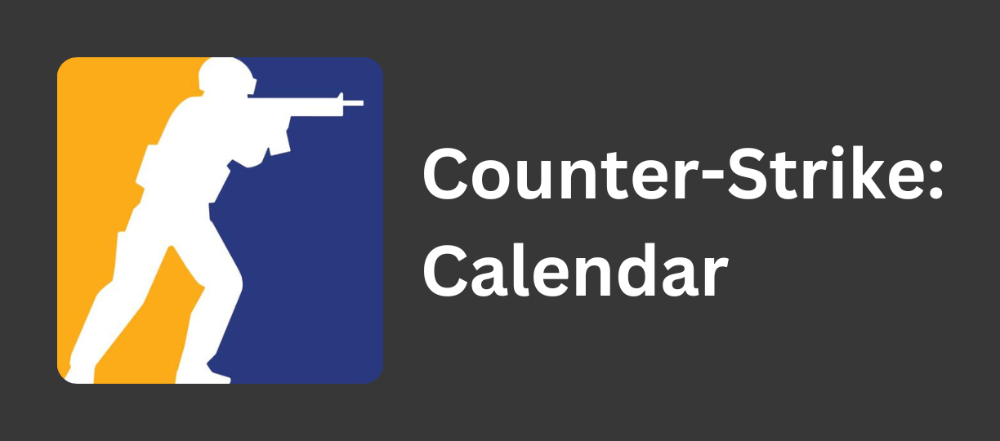

A calendar for all professional tier one CS matches using the help of gigobyte's <a href=https://github.com/gigobyte/HLTV>HLTV API</a>.

  

# ⚠️ Please note that this project is currently undergoing a rewrite. It is not functioning as intended. ⚠️

  

## Features

<ul>
    <li>Grabs all tier 1 matches from HLTV's "Featured" events page</li>
    <li>Updates past matches to include the score</li>
    <li>Updates every hour</li>
</ul>

## Known Problems / Future Improvements

- [ ] Randomly fetches unfeatured matches for some reason (PLEASE pull request this if you have a fix)
- [ ] Include match data including event, format, and stats in the calendar event description
- [ ] Somehow fix HLTV's occasional Cloudflare rate limiting when fetching with the API

## Usage

### Google Calendar:

1. Copy the [link](https://silasmcnutt.github.io/counter-strike-calendar/ics/finalCalendar.ics) to the .ics file
2. Go to your Google Calendar
3. Other Calendars > + > From URL and then paste the link

_Optional_ - Change update time to be every hour:

1. Go to derekantrican's [GAS-ICS-Sync repo](https://github.com/derekantrican/GAS-ICS-Sync)
2. Open a new copy of the script ([link](https://script.google.com/d/1BOk8MDLbLaHh6SwG1M1tsgNXjkcC-79LE0QoipRuTDxbO3fMVvqoROQD/edit?newcopy=true))
3. Follow the instructions, changing the settings as you please

## Support

If you have any questions or suggestions regaerding the spreadsheet, please feel free to reach out and message me on Discord. My username is `mcsilas.` (yes, the period is included).

## License

This project is licensed under the terms of the [MIT](https://github.com/silasmcnutt/ultimate-coaster-spreadsheet/blob/main/LICENSE.txt) license.
